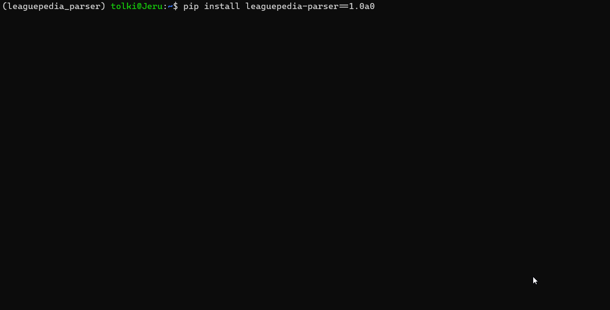

[](https://shields.io/)
[](https://github.com/psf/black)

# leaguepedia_parser
A parser for Leaguepedia focused on accessing esports data.

It is very minimal at the moment and focused on my own usage of Leaguepedia’s data. Pull requests to add features are
more than welcome! 

# Install
`pip install leaguepedia_parser`

# Demo


# Usage
```python
import leaguepedia_parser

# Gets regions names
regions = leaguepedia_parser.get_regions() 

# Gets tournaments in the region, by default only returns primary tournaments
tournaments = leaguepedia_parser.get_tournaments("Korea", year=2020)

# Gets all games for a tournament. Get the name from get_tournaments()
games = leaguepedia_parser.get_games("LCK 2020 Spring")

# Gets picks and bans and other details from a game. Get the game object from get_games()
game = leaguepedia_parser.get_game_details(games[0])

# Gets the URL of the team’s logo
logo_url = leaguepedia_parser.get_team_logo('T1')
```

More usage examples can be found in the [`_tests` folder](https://github.com/mrtolkien/leaguepedia_parser/tree/master/leaguepedia_parser/_tests).
